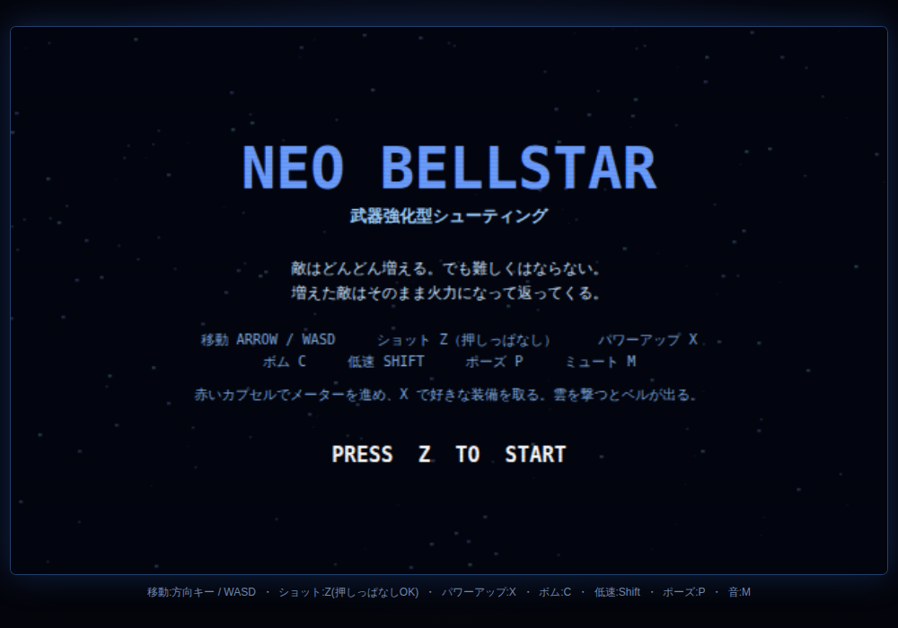
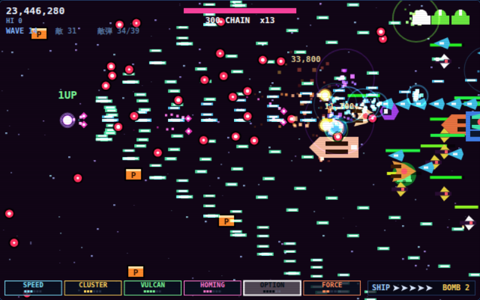

# NEO BELLSTAR

ツインビー／グラディウス系の **武器強化型シューティング**。
横スクロール、HTML5 Canvas 製。ビルド不要、`index.html` を開けば動く。




---

## コンセプト

> **敵はどんどん増え、強くもなる。それでも武器の伸びのほうが速い。**

自機の火力は最終的に初期の **67 倍**になる（`tools/dps-bench.js` による実測）。
内訳は 1 発の威力だけでなく、撃てる範囲の広さも含む。
つまり「1 体を速く倒せる」より「画面全体を同時に叩ける」方向に伸びる。
脅威の伸びをそれより小さくしておけば、強くなるほど有利にはなる。
ただし差を開けすぎると、パワーアップするたびに手応えが消えて作業になる。
そこで脅威側は **「火力の伸びを超えない範囲で、できるだけ追いかける」** ように設計してある。

実測値（`node tools/smoke-test.js` の出力より）:

| | 開始時 | 上限到達時 | 伸び |
|---|---|---|---|
| 敵の湧く量 | 1.5 匹/秒 | 62 匹/秒 | 41 倍 |
| **自機の火力** | 8 DPS | 534 DPS | **67 倍** |
| 撃ってくる敵 | 8 体 | 34 体 | 4.3 倍 |
| 敵弾の上限 | 18 発 | 62 発 | 3.4 倍 |
| 重装敵の HP | ×1.0 | ×2.6 | 2.6 倍 |
| 敵弾の速さ | 120 px/秒 | 188 px/秒 | 1.6 倍 |
| 武装編隊の比率 | 10% | 66% | — |

結果として、自機が居られる安全な面積は時間とともにこう変化する。

| 経過 | 画面内の敵 | 安全な面積 | 自機の列の逃げ道 |
|---|---|---|---|
| 100 秒 | 9 | 100% | 333px / 336px |
| 200 秒 | 58 | 74% | 184px |
| 350 秒 | 100 | 68% | 148px |

序盤はほぼ無風、終盤は画面の 3 割強が危険地帯になる。

---

## 難易度側の設計

### 脅威は「経過時間」と「自機の装備」の両方で上がる

時間だけに紐づけると、装備が揃うほど一方的になる。
そこで **実効ウェーブ = 経過ウェーブ ＋ 装備の充実度 × 13** とし、
フル装備なら 13 ウェーブぶん先の脅威と戦うことにしてある。

```js
// js/config.js
CFG.threatWave = function (G) {
  var ratio = Weapons.powerRatio(G.pw);      // 0〜1
  return G.wave + ratio * CFG.threatFromPower;
};
```

脅威側のパラメータはすべてこの値で評価される。
強くなればそのぶん相手も濃くなるが、
火力の伸び（19 倍）が脅威の伸び（最大 4.3 倍）を上回っているので、
差し引きでは必ず有利になる。

この係数を上げすぎると「強くなったら罰される」感覚になるので、
調整するときは `threatFromPower` を少しずつ動かすこと。

### 上がるもの（`CFG.curve`）

難しくなる要素はすべてここに集約されている。ここ以外では難易度は上がらない。

```js
curve: {
  budget:   { base: 18,   per: 1.60,   max: 62 },  // 画面上の敵弾の上限
  speed:    { base: 120,  per: 3.00,   max: 188 }, // 敵弾の速さ(px/秒)
  aim:      { base: 0.20, per: -0.006, min: 0.06 },// 狙い撃ちのブレ(rad)
  armed:    { base: 8,    per: 0.95,   max: 34 },  // 撃ってくる敵の同時数
  tough:    { base: 1.0,  per: 0.075,  max: 2.6 }, // 重装敵の HP 倍率
  armedMix: { base: 0.10, per: 0.035,  max: 0.66 } // 編隊が武装型になる確率
}
```

**弾幕予算（bullet budget）** — 画面上に存在できる敵弾の総数の上限。
敵が 5 匹でも 190 匹でも上限は同じで、敵が増えるほど 1 匹あたりの発射確率が自動で下がる。
上限そのものは実効ウェーブとともに 18 → 62 発へ伸びる。
画面左上の `敵弾 n/上限` がその天井で、プレイヤーが目で確認できるようにしてある。

### 撃ち返してくる敵

数の暴力だけでは、火力が伸びた側が一方的に強くなる。
そこで「倒すのに時間がかかり、その間ずっと撃ってくる」敵を用意し、
進むほどその比率（`armedMix`）を上げている。

| 敵 | HP | 攻撃 | 動き |
|---|---|---|---|
| 砲台 | 5 | 単発 | 上下の壁を流れる |
| ポッド | 7 | 3way | 画面右で滞空 |
| **狙撃機** | 10 | 高速単発 | 右端に 7 秒陣取って撃つ |
| **連射砲台** | 14 | 3 連射 | 滞空 |
| **砲艦** | 24 | 3way ×2 連射 | 上下に動きながら前進 |
| **重装** | 38 | 5 way 扇状 | ゆっくり確実に押し込んでくる |
| 大型艦 | 46 | 単発 | 滞空 |

太字が今回追加した型。HP はさらに `tough` 倍率（最大 2.6 倍）が掛かるので、
終盤の重装は実質 HP 100 近くになる。

**ザコの HP は最後まで 1〜2 のまま**上げていない。
全体を硬くすると武器を強化した手応えがそのまま消えるが、
撃ち込む対象だけを硬くするなら、雑魚を薙ぎ払う快感は残るため。

硬い敵は倒したときにカプセルを落とす（`capChance`）。
硬い敵が増えると撃破数そのものが伸びないので、
撃破数基準の供給だけではパワーアップが止まってしまうため。
「硬い相手を倒したぶんだけ強くなる」という手応えも兼ねている。

### 上げないもの

- **ザコの HP** … 上記のとおり
- **敵弾は必ず自機より遅い** … 上限 188 px/秒 に対し自機は最低でも 195 px/秒。
  反応速度ではなく位置取りで避けられる状態を保つ
- **ミス時のペナルティ** … 失うのはオプション 1 個とバリアだけ。
  グラディウス式の全ロストは、ミスした瞬間に難易度が跳ね上がる典型的な罠
- **復帰位置の安全** … ミス後は復帰地点の周囲 165px の敵と全敵弾を消す。
  詰まったまま復帰して連続で死に続ける「復活パターン殺し」を潰すため

### 密度の上限は難易度そのもの

体当たりは自機を壊すので、画面内の敵の最大数（`director.aliveMax = 190`）は
処理落ち対策ではなく難易度設定になる。密度が火力で掃ける量を超えると
立つ場所が無くなり、腕前と無関係に事故死するだけのゲームになる。

この値は勘ではなく実測で決めた。自機が居られる領域を格子状に走査して
「安全な面積の割合」と「連続して安全な高さ」を出している（上のコンセプト節の表）。

---

## 爽快感側の設計

### 武器は 3 系統・すべて加算

排他の切り替えは無い。取ったぶんだけ同時に撃つ。
どれか 1 系統を伸ばせば尖り、散らせば穴が無くなる、という選び方になる。

| 装備 | 段数 | 伸び方 |
|---|---|---|
| SPEED | 6 | 移動速度 195 → 387 px/秒 |
| **CLUSTER** | 6 | 着弾で爆発。範囲と破片が増える（1発→範囲→2発→破片増→威力→3発） |
| **VULCAN** | 6 | 正面の拡散弾（2way→3way→威力→5way→威力→7way） |
| **HOMING** | 6 | 追尾弾の群れ（1発→2発→威力→4発→威力→6発） |
| OPTION | 6 | 分身が 6 基まで。VULCAN がそのまま倍化する |
| FORCE | 5 | バリアの耐弾数 3 → 5 → 7 → 9 → 12 |

1 段ごとに必ず何かが目に見えて変わるよう、
**「弾の本数が増える段」と「威力が上がる段」を交互に**並べてある。
本数だけ増やすと画面が自弾で埋まり、威力だけ上げると見た目が変わらず実感が出ない。

オプションは本体より撃つ弾を絞ってある（`weapon.optionAngles`）。
6 基が本体と同じだけ撃つと 1 回の発射が 40 発を超え、
敵も敵弾も自弾に隠れて見えなくなるため。

### レーザーを廃止した理由

貫通する一本の線は、並んだ敵をまとめて貫くぶん他の武器より明確に強く、
「どんな状況でもレーザーを選べばいい」という一択を作ってしまう。
しかも画面を横切る太い光が敵と敵弾を覆い隠す。

代わりに、得意な状況がはっきり違う 3 系統に置き換えた。
`node tools/dps-bench.js` は、倒れない的を 2 通りに並べて
1 秒あたりの与ダメージ（DPS）を実測する。

| 武器構成 | 密集した的 | 散開した的 | 差 |
|---|---|---|---|
| 初期装備 | 8 | 8 | 1.0 倍 |
| VULCAN 6 | 25 | 98 | 3.9 倍 |
| HOMING 6 | 80 | 83 | 1.0 倍 |
| CLUSTER 6 | 298 | 84 | 3.5 倍 |
| 3 系統 6 + OPTION 6 | 534 | 399 | 1.3 倍 |

- **VULCAN** は広い正面をなぎ払う。遠くの小さな塊には当たりにくい
- **HOMING** はどこにいても一定。外れない代わりに 1 発の威力は低い
- **CLUSTER** は固まった敵に桁違いに効く。単体相手には並

両方の列で突出している武器が無いこと、
これがレーザーのときに欠けていた条件。
バランスを変えたら、このベンチで「1.0 倍に近くて両方高い武器」が
生まれていないかを見ればいい。

### 装備の伸び方

計画的に取ると **30〜60 秒ごとに何かが増える**（実測）:

| 経過 | 到達 |
|---|---|
| 1 分 | SPEED×2、CLUSTER |
| 2 分 | OPTION×1 |
| 3 分 | OPTION×2〜3 |
| 5 分 | OPTION×6 |
| 6 分 | VULCAN が伸び始める |

装備をひと通り最大にするには約 84 個のカプセルが要る。
全部を平均に伸ばすより、まず 1 系統に寄せたほうが手応えは早い。

### チェイン（連鎖）

短時間に倒し続けるほどゲージが伸び、**連射速度が最大 1.7 倍**になり、
30 連鎖・90 連鎖でサイドショットが自動で追加される。得点倍率も上がる。

敵が多いほど連鎖が途切れない ＝ **敵が多いほど自機が強い**。
密度の上昇が自動的に火力上昇に変換される自己平衡の仕組み。

### アイテムは絞ってある

画面を埋めるのは敵であってアイテムではない、という方針。

- カプセルは画面内 **4 個**まで、最短 **1.6 秒**間隔
- ベルは画面内 **3 個**まで
- 必要撃破数はウェーブとともに増える（10 → 60 匹）。
  固定のままだと終盤に毎秒何個も降ってきて、
  メーターのカーソルが速く回りすぎて狙った装備を選べなくなる
- 大型艦のまとめ落としも画面内上限を守る。
  出せなかったぶんは得点に振り替わる

### 演出

加算合成のパーティクル、衝撃波リング、大型撃破時のヒットストップ（一瞬の静止）、
チェインに応じた画面の色づき、パララックス星空。

**画面揺れは使っていない。** 狙って避ける操作の最中に画面ごと動くと、
自機と敵弾の位置が読み取りにくくなるため。手応えはヒットストップと閃光で出す。
（`CFG.fx.shake` を `true` にすれば揺れは復活する）

負荷が上がるとパーティクル量を自動で落とすので、敵が 200 匹出ても操作は重くならない。

### 音も強くなる

BGM はレイヤー方式で、装備が増えるほど楽器が増える
（ベース → アルペジオ → ハイハット → リード）。音声ファイルは使わず、
WebAudio のオシレーターで合成している。

---

## 遊び方

| 操作 | キー |
|---|---|
| 移動 | 方向キー / WASD |
| ショット | Z または Space（押しっぱなしで連射） |
| パワーアップ発動 | X |
| ボム | C |
| 低速移動 | Shift |
| ポーズ | P |
| ミュート | M |
| リスタート | R |

スマホ・タブレットでは画面をドラッグで移動、触れている間は自動連射。

### パワーアップの流れ（グラディウス方式）

1. 赤いカプセル `P` を取ると、画面下のメーターのカーソルが 1 つ進む
2. 欲しいスロットで **X** を押すと発動し、メーターは 0 に戻る
3. `SPEED → CLUSTER → VULCAN → HOMING → OPTION → FORCE` の順で、
   奥のスロットほど強力だが、そのぶんカプセルを溜める必要がある

早めに OPTION を取りに行くか、先に SPEED で動きやすくするかは好み。

### ベル（ツインビー方式）

雲を撃つとベルが出る。**ベルを撃つたびに色が変わり、効果も変わる**。

| 色 | 効果 |
|---|---|
| 黄 | 3000 点 |
| 青 | スピードアップ |
| 白 | VULCAN 強化 |
| 桃 | HOMING 強化 |
| 緑 | オプション追加 |
| 赤 | バリア |

落ちてくる前に撃ち上げて、欲しい色に合わせてから取る。

---

## 動かし方

```sh
# そのまま開くだけ（ビルド不要・依存なし）
open index.html

# ローカルサーバ経由で動かす場合
npx http-server -p 8080 .
```

### 自動検証

```sh
node tools/smoke-test.js
```

ヘッドレス Chromium でゲーム内 6 分ぶんを実際に動かし、以下を確認する。

- 読み込み時・プレイ中に JS エラーが出ないこと
- **敵弾がその時点の予算を 1 フレームも超えないこと**
  （予算は実効ウェーブで変わり、自機が弱くなると下がるので、
  「それまでに見た予算の最大値」を上限として検証する）
- **難易度の伸びが火力の伸び（19 倍）を超えていないこと**
- 混雑時のフレームレート（中央値 60fps、20ms 超のフレームが 15% 未満）

スクリーンショットは `docs/` に保存される。

```sh
node tools/dps-bench.js
```

武器バランスを変えたときはこちらも走らせる。
特定の武器がどの的の並びでも突出していたら、それは一択を作る武器。

---

## ファイル構成

| ファイル | 役割 |
|---|---|
| `js/config.js` | **全パラメータと設計思想**。難易度カーブもここ 1 か所 |
| `js/util.js` | 汎用ヘルパ |
| `js/input.js` | キーボード・タッチ入力 |
| `js/audio.js` | WebAudio による効果音とレイヤー BGM（音声ファイル不要） |
| `js/effects.js` | パーティクル・衝撃波・星空・自動画質調整 |
| `js/weapons.js` | パワーメーターと多段階の武器 |
| `js/player.js` | 自機とオプション |
| `js/enemies.js` | 敵の定義・動き・弾幕予算・スプライトキャッシュ |
| `js/items.js` | カプセルとベル（供給制限つき） |
| `js/director.js` | 敵の出現管理 |
| `js/hud.js` | スコア表示・パワーメーター・各種画面 |
| `js/game.js` | 状態管理・当たり判定・スコア |
| `js/main.js` | 固定タイムステップのメインループ |
| `tools/smoke-test.js` | ヘッドレス自動検証 |
| `tools/dps-bench.js` | 武器ごとの実効 DPS を実測する（武器バランス用） |

---

## 調整したいときに触る場所

すべて `js/config.js`。

```js
threatFromPower       // 装備の充実度が脅威に効く量。手応えの主スイッチ
curve.armed           // 撃ってくる敵の同時数の伸び
curve.armedMix        // 編隊が武装型になる確率の伸び
curve.tough           // 重装敵の HP 倍率の伸び
curve.budget          // 敵弾の上限の伸び
curve.speed           // 敵弾の速さの伸び（自機の 195px/秒 を超えさせない）
director.aliveMax     // 画面内の敵の最大数。体当たりが有効なので難易度に直結
director.countPerWave // 1 編隊あたりの敵の増え方
item.capsuleOnScreenMax // 画面内のカプセル数
weapon.optionMax      // オプションの最大数（火力の伸びに直結）
weapon.vulcanMax / homingMax / clusterMax  // 各武器の段数
fx.shake              // 画面揺れ（既定 false）
```

**もっと歯ごたえが欲しい**なら、まず `threatFromPower`（既定 13）を上げる。
装備が揃ってからの手応えだけが増え、序盤は変わらないので副作用が小さい。
次に `curve.armedMix` と `curve.tough`。

**もっと敵で埋め尽くしたい**なら `director.countPerWave` と `aliveMax` を上げる。
その場合は安全率も一緒に確認したほうがいい。
70% を下回り始めると、腕前と無関係な事故死が増える。

**難しすぎる**なら `threatFromPower` を 6〜9 に下げるか、
`curve.armed.max` と `curve.budget.max` を下げる。
`curve.speed.max` を 195 より上げるのだけは避けること。
「見てから避ける」が成立しなくなり、質の違う難しさになる。

---

## 用語

- **DPS** … Damage Per Second。1 秒あたりに与えられるダメージ量。火力の指標
- **TTK** … Time To Kill。敵 1 匹を倒すのにかかる時間
- **オプション（マルチプル）** … 自機の軌跡を追って同じ弾を撃つ分身
- **オブジェクトプール** … 使い回し用に確保しておく配列。
  毎フレーム大量に生成・破棄するとゴミ集め（GC）で一瞬固まるのを防ぐ
- **加算合成（lighter）** … 色を足し算で重ねる描画方式。光が重なるほど白く飛ぶ
- **固定タイムステップ** … 更新を常に 1/60 秒刻みで行う方式。
  フレームレートが揺れても弾速や当たり判定がブレない
